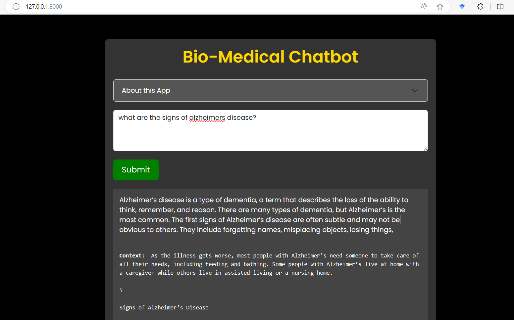

# Medical-RAG-using-Bio-Mistral-7B

  
 This is a medical chatbot capable of answering questions on the medical domain. The capabilites of the chatbot are improved using a RAG implementation where we use external knowledge sources like pdf/txt files from NIH, PubMed etc. to get more accurate responses.

The chatbot is built using:

- Open-source [Bio-Mistral 7B](https://huggingface.co/BioMistral/BioMistral-7B) model as our base LLM
- [PubMedBERT Embedding](https://huggingface.co/NeuML/pubmedbert-base-embeddings) model to generate sentence embeddings/vectors
- [Qdrant](https://qdrant.tech/) as vector database to store the embeddings from the pdfs/txt files
- [Langchain](https://www.langchain.com/) for LLM integration and orchestration

## How to run

- Install [docker](https://www.docker.com/get-started/) if not installed already and then do `docker pull qdrant/qdrant`(req. only for the first time) and then `docker run -p 6333:6333 qdrant/qdrant` to setup the database. The database should be accessible at `localhost:6333/dashboard`
- Create a python virtual environment. (Below we show using `conda` package manager. For Linux/MacOS, `pip3` should work well)  
  `conda env create -f environment.yml`
  and then `conda activate biorag`
- Download the Bio-Mistral-7B model from [here](https://huggingface.co/MaziyarPanahi/BioMistral-7B-GGUF) (not on the git repo due to size constraints). We are using the quantized version for fast inference.
- Add your data files in the `data` folder. We have 2 sample pdfs for Alzheimers & Cancer.
- Run `python ingest.py` to create embeddings from the pdfs and store in the database
- Finally, run `uvicorn app:app` to launch the chatbot application.

## Things to consider

- The application takes ~30 seconds to generate responses as the inferences are done on CPU and thus can be run on any standard system without GPU support.
- The database creation time will depend on the size and number of pdf files. The performance can be improved by using fast PDF parsers like `PyMuPdf`

## Disclaimer

- The application should not be used as substitute for professional medical guidance
